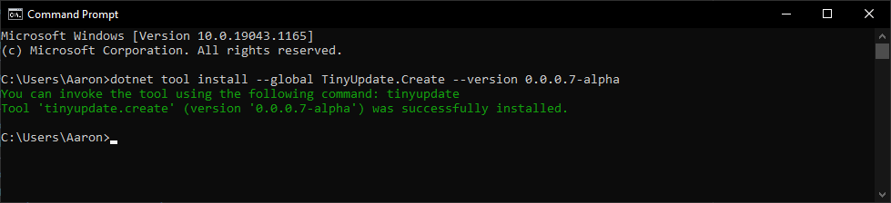
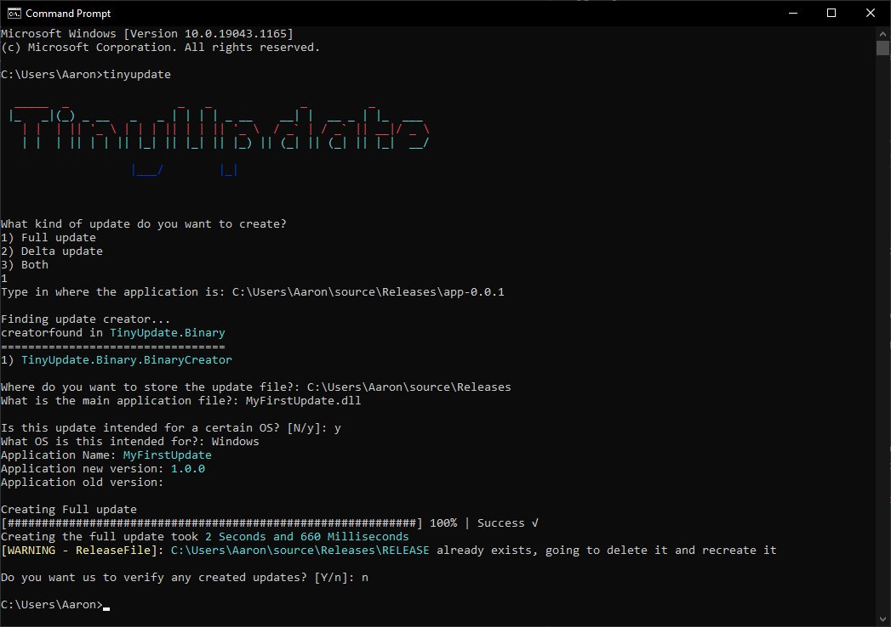

# Step 2 - Packaging
#### In order to package the application, you need to prepare the application files for distribution. In order to do this we first need to add the application version, build the application and then run `TinyUpdate.Create`

## Prep for building

Before you build your application you need to set your application version, in order to do this go to your csproj file and add this in any ``PropertyGroup`` without a ``Condition``:
```xml
<AssemblyVersion>0.0.0.1</AssemblyVersion>
<FileVersion>0.0.0.1</FileVersion>
```

## Building

The build process might depend on your needs but for this example, go to your terminal of choice, cd into the project folder and type in `dotnet publish -c Release -r <os your on>-x64`. 

This will create all the files needed for the application to run at `bin\Release\{net version}\{os}\publish`. Copy this folder into the folder which will keep all your releases (We will be storing ours at `C:\Users\Aaron\source\Releases`) and the rename that folder you copied with the application version

## Package

Now that we got the files needed, we need to make the actual update files. In order to do that we need to first get `TinyUpdate.Create`, in order to get this put `dotnet tool install --global TinyUpdate.Create --version 0.0.0.8-alpha` in a CLI.

**Note**: We only need ``--version 0.0.0.8-alpha`` while the application is not in a stable state. When the first stable release is pushed you won't need this part anymore

Once we done that, we can load it up by typing in `tinyupdate`, as this is the first version of the application we will want to make a full update

**Note**: When it asks you for the Main application file, it means the file that contains the main assembly, not the actual executable (Normally ``{application namespace}.dll``).

As long the Creator doesn't fail you will now have an update file that you can use and a RELEASE file. We talk about what these files do in the next step!

## Overview
1. [Integrating](integrating.md) - How to integrate TinyUpdate into your application
2. **[Packaging](packaging.md)** - How to package your application files and prepare them for release
3. [Distributing](distributing.md) - How to provide updates files to your users
4. [Installing](installing.md) - This hasn't been implemented yet, come back later when that's the case!
5. [Updating](updating.md) - How we go about the update process